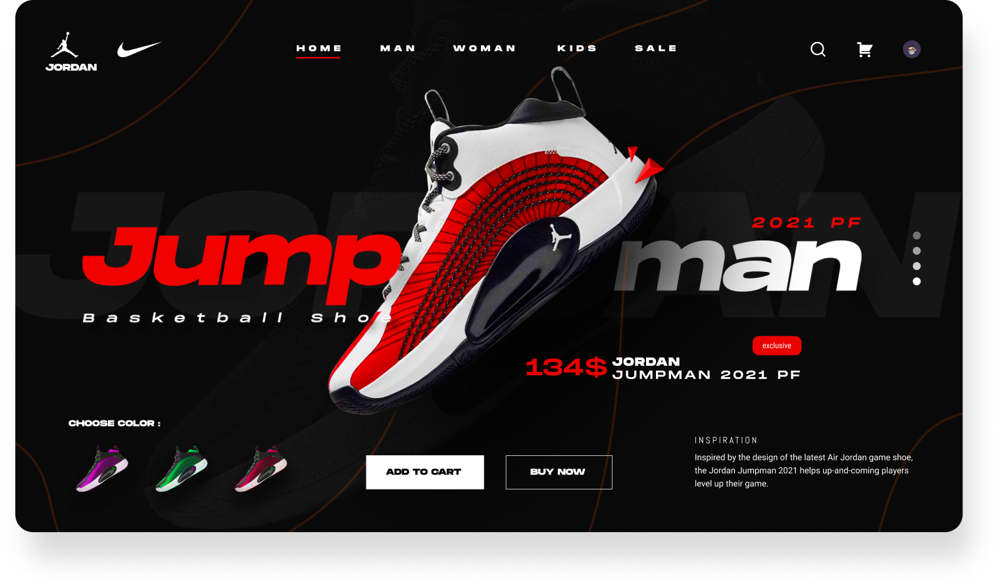

# 🏀 AirJodan Tutorials – Modern Sneaker Landing Page  
*A React + Vite + Tailwind CSS UI Project*

##  🚀 Live Demo (Optional)



## Overview

AirJodan Tutorials is a modern product landing page built to showcase clean UI/UX, premium branding, and responsive layouts using **React**, **Vite**, and **Tailwind CSS**.

This project is ideal for developers learning front-end fundamentals, practicing component-based architecture, or exploring how to turn UI designs into production-ready code.


## ✨ Why This Project Is Useful

- **Modern Frontend Stack** – Uses Vite for blazing-fast development and Tailwind for utility-first styling  
- **Clean, Reusable Components** – Easy for beginners to read and extend  
- **Fully Responsive Design** – Works perfectly on mobile, tablet, and desktop  
- **Easy to Customize** – Swap images, colors, or text for any product  
- **Great for portfolios & tutorials** – A real-world UI that looks premium and professional  


## 📦 Getting Started

Follow the steps below to clone, install, and run the project locally.

### 1️⃣ Clone the Repository

```bash
git clone https://github.com/Abdulai059/airjodan-tutorials.git
cd airjodan-tutorials

```
### 2️⃣ Install Dependencies

```bash
npm install

```
### 3️⃣ Run the Development Server
```bash

npm run dev
```
## 🔧 Project Structure

```bash
airjodan-tutorials/
│── public/
│── src/
│   ├── assets/            
│   ├── components/        
│   ├── App.jsx            
│   └── main.jsx           
│── .gitignore
│── index.html
│── package.json
│── tailwind.config.js
│── vite.config.js
│── README.md


```
## 📚 Documentation & Help

If you need help with:

### React, Vite, Tailwind CSS

For project-specific issues:

Open an issue here → Issues tab on GitHub

Or contact the maintainer (see below)
